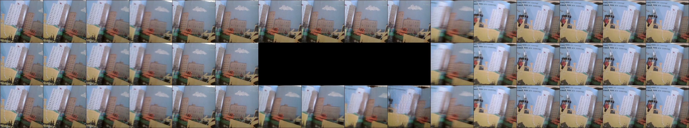
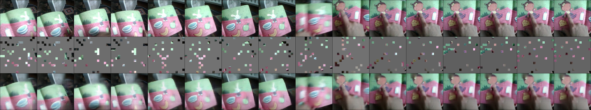
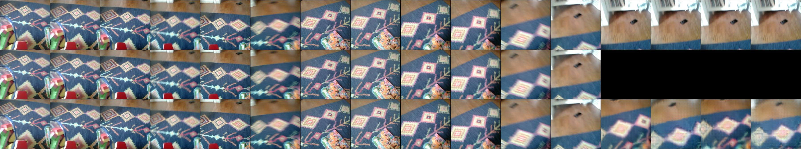
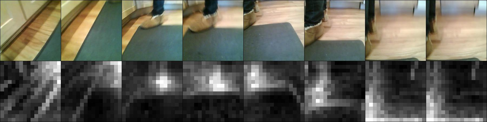

# A menagerie of video models trained on various video datasets

**Update (Oct 3, 2024):** All models in this repository are updated. We retrained all the models with a larger batch size and for much longer. This resulted in substantial improvements in downstream evaluations. Please see the updated arxiv preprint below for the new evaluation results. If you downloaded any of the models here before Oct 3, 2024, please redownload them from this repository again for much improved versions.

---

This is a stand-alone repository to facilitate the use of all video models I have trained so far. The models are all hosted on [this Huggingface repository](https://huggingface.co/eminorhan/video-models). For a detailed description of the models available in this repository and their capabilities, please see the following paper:

Orhan AE, Wang W, Wang AN, Ren M, Lake BM (2024) [Self-supervised learning of video representations from a child's perspective.](https://arxiv.org/abs/2402.00300) *CogSci 2024* (oral).

## What you need:
* A reasonably recent version of PyTorch and torchvision. The code was tested with `pytorch==1.11.0` and `torchvision==0.12.0`. Later versions would likely work fine as well.
* The `huggingface_hub` library to download the models from the Huggingface Hub. The code was tested with `huggingface-hub==0.14.1`.
* The model definitions rely on the `timm` library. The code was tested with `timm==0.3.2`.
* You **do not** need a GPU to load and use these models, although, of course, things will run faster on a GPU. 

## Loading the models
Model names are specified in the format `x_y_z`, where `x` is the model type, `y` is the pretraining data the model is trained with, and `z` is the finetuning data the model is finetuned with (if any). All models have a ViT-H/14 backbone.

* `x` can be one of `mae`, `vit`
* `y` can be one of `say`, `s`, `kinetics`, `kinetics-200h`
* `z` can be one of `none`, `ssv2-10shot`, `ssv2-50shot`, `kinetics-10shot`, `kinetics-50shot`

Loading a pretrained model is then as easy as:

```python
from utils import load_model

model = load_model('vit_s_none')
```

This will download the corresponding pretrained checkpoint, store it in cache, build the right model architecture, and load the pretrained weights onto the model, all in one go.

### Explanations
**Model types (`x`):**
* `mae` will instantiate a spatiotemporal MAE architecture (with an encoder and a decoder) 
* `vit` will instantiate a standard spatiotemporal ViT-H/14 architecture. 

If you'd like to continue training the pretrained models on some new data with the spatiotemporal MAE objective or if you'd like to analyze the pretrained MAE models (for example, analyze their video interpolation capabilities), you should use the `mae` option. If you'd like to finetune the model on a standard downstream video/image recognition task, or something similar, you should choose the `vit` option instead.

**Pretraining data (`y`):** 
* `say`: the full SAYCam dataset
* `s`: child S only
* `kinetics`: the full Kinetics-700 dataset
* `kinetics-200h`: a 200-hour subset of Kinetics-700  

The models were all pretrained with the spatiotemporal MAE objective using code from [this repository](https://github.com/eminorhan/mae_st). The SLURM batch scripts used for training all models can be found [here](https://github.com/eminorhan/mae_st/tree/master/scripts). 

**Finetuning data (`z`):** 
* `none`: no finetuning (you will need to use this option if you choose the `mae` option for `x`) 
* `ssv2-10shot`: the 10-shot SSV2 task 
* `ssv2-50shot`: the 50-shot SSV2 task
* `kinetics-10shot`: the 10-shot Kinetics-700 task 
* `kinetics-50shot`: the 50-shot Kinetics-700 task 

The models were again all finetuned with code from [this repository](https://github.com/eminorhan/mae_st). The SLURM batch scripts used for finetuning all models can be found [here](https://github.com/eminorhan/mae_st/tree/master/scripts/finetune).

You can see a full list of all available models by running:
```python
>>> print(utils.get_available_models())
```

You will get an error if you try to load an unavailable model.

## Visualizing the model completions
In [`visualize_completion.py`](https://github.com/eminorhan/video-models/blob/master/visualize_completion.py), I provide sample code to visualize model completions from pretrained spatiotemporal MAE models. An example usage would be as follows:
```python
python -u visualize_completion.py \
        --model_name 'mae_s_none' \
        --mask_ratio 0.25 \
        --mask_type 'center' \
        --video_dir 'demo_videos' \
        --num_vids 16 \
        --device 'cuda'
```
This will randomly sample `num_vids` videos from `video_dir` and visualize the model completions together with the original sequence of frames and the masked frames. Currently, three types of masking strategies are supported: `random` (random spatiotemporal masking as in pretraining), `temporal` (masking out the final portion of the sequence), and `center` (masking out the middle part of the sequence, as described in the paper). Running the code with these masking strategies will produce images like the following, where the top row is the original sequence, the middle row is the masked sequence, and the bottom row is the model completion:

**`center`:**


**`random`:**


**`temporal`:**


Further examples can be found in the [comps](https://github.com/eminorhan/video-models/tree/master/comps) folder.

## Visualizing the attention maps
In [`visualize_attention.py`](https://github.com/eminorhan/video-models/blob/master/visualize_attention.py), I provide sample code to visualize the last-layer attention maps of the pretrained models. An example usage would be as follows:
```python
python -u visualize_attention.py \
        --model_name 'vit_s_none' \
        --video_dir 'demo_videos' \
        --num_vids 16 \
        --device 'cuda'
```
Similar to the above, this will randomly sample `num_vids` videos from `video_dir` and visualize the last-layer attention maps (averaged over all attention heads) together with the original sequence of frames. Running the above will produce images like the following:

**`vit_s_none`:**


Further examples can be found in the [atts](https://github.com/eminorhan/video-models/tree/master/atts) folder.

It should be straightforward to hack the code to obtain the individual attention heads if you'd like to visualize them separately.

## Testing on video recognition
I also include some minimal test code in [`test_video_recognition.py`](https://github.com/eminorhan/video-models/blob/master/test_video_recognition.py) to check the validation accuracy of the finetuned models in downstream video recognition tasks (SSV2 or Kinetics-700). You can use it as follows:
```python
python -u test_video_recognition.py \
        --model_name 'vit_s_ssv2-50shot' \
        --img_size 224 \
        --batch_size 256 \
        --val_dir VAL_DIR \
```
where `val_dir` is the path to the validation set of the appropriate downstream recognition task. Note that the task should be the same as the one the model was finetuned on.

## Acknowledgments
The model definitions and parts of the code here are recycled from Facebook's excellent [Spatiotemporal Masked Autoencoders](https://github.com/facebookresearch/mae_st) repository.
